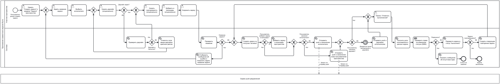
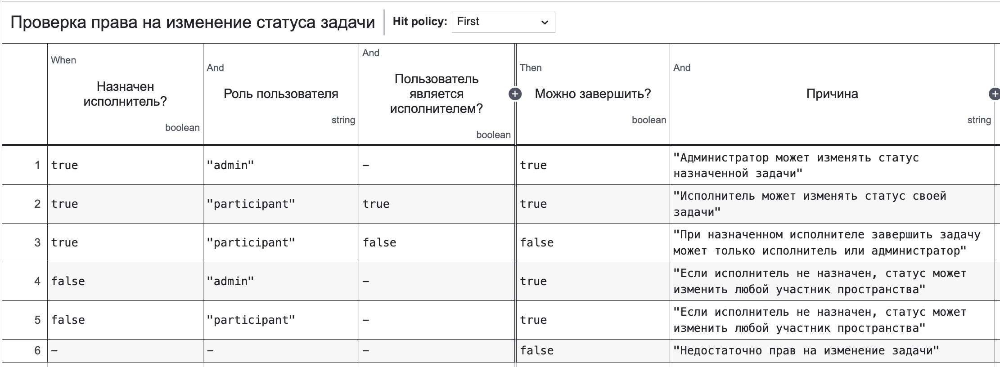

Бизнес-процесс создания и выполнения задачи (FR-05/FR-06): 

[BPMN - xml (FR-05/FR-06)](bpmn/bpmn_xml)

В данной BPMN-модели DMN используется в точке проверки прав на изменение статуса задачи. Это оправдано тем, что в требованиях задано бизнес-правило о том, что если у задачи есть исполнитель, то статус может менять исполнитель задачи или администратор пространства, а если исполнитель не назначен, то любой участник пространства. 

Решение зависит сразу от нескольких входных параметров: назначен ли исполнитель, какова роль пользователя и является ли текущий пользователь исполнителем. Поэтому удобнее вынести эту логику в DMN, а не усложнять BPMN множеством ветвлений.

Кроме того, в дальнейших релизах планируются расширенные роли, поэтому вынесение проверки прав в DMN упрощает дальнейшие модификации процесса.

[DMN - xml (FR-05/FR-06)](bpmn/dmn_xml)

