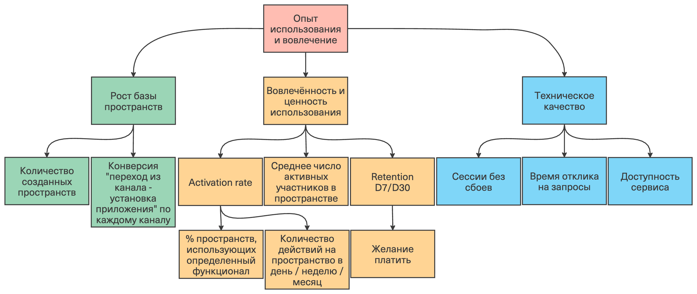

###  ***Бизнес-требования***

**1. Описание проблемы**

Люди, ведущие совместный быт (пара/семья/соседи с нянями/уборщиками/поварами - назовём их сожителями), обычно сталкиваются с большим количеством совместных бытовых задач:
- Дела по дому: требуют распределения между сожителями.
- Составление списка покупок: сожители должны формировать общий список покупок.
- Учёт бюджета: сожители должны планировать бюджет, учитывать расходы, разделять траты.
- Учёт занятости: сожители могут планировать совместные дела, дела друг для друга.

Потребности и боли целевой аудитории:
- Фиксировать, что нужно сделать или купить.
- Распределять обязанности и понимать, кто что должен делать и кто что делал.
- Иметь чёткое представление о тратах с возможностью отслеживать и разделять траты.
- Устанавливать напоминания и уведомления себе и сожителям о планах и задачах.
- Иметь общее онлайн-пространство (одно или несколько).

Ключевой момент: сожители нуждаются в инструменте, который позволит ***удобно*** вести описанные задачи.

Текущие альтернативы:
- Обсуждать устно и держать в голове.
- Обсуждать в чатах мессенджеров.
- Заметки и списки в приложениях (Google Keep, Apple Notes, Todoist).
- Таблицы в Excel/Google Sheets.
- Рабочие пространства (Notion, Obsidian).

Также дополнительно могут использоваться календари и приложения для ведения расходов.

Данные решения либо нацелены на решение узкого круга задач, либо не предполагают совместного ведения, либо требуют сложной настройки, либо неудобны в использовании (например, не предоставляют возможности удобного использования с телефона). 
Следовательно, вести совместные бытовые дела с помощью приведенных решений обычно неудобно, при этом для полного контроля требуется использовать несколько решений одновременно.

Предлагаемый продукт даёт возможность иметь единый инструмент для совместного ведения быта, который объединяет ключевые бытовые процессы в одном месте и позволяет упростить планирование, за счет чего снижает количество конфликтов и забываний.

**2. Целевая аудитория**

**Сегменты аудитории**:
- Пары, живущие вместе.
- Семьи.
- Соседи по квартире/комнате.

В том числе с нянями/уборщиками/поварами.

Пользователями могут быть ***любые*** люди, способные пользоваться телефоном, ведущие совместный быт.

**Потребности и ожидания**:
- Быстрое добавление задач и покупок в списки себе и сожителям.
- Удобный интерфейс для телефона.
- Получать, отправлять и настраивать напоминания и уведомления.
- Отслеживать статусы дел и покупок.
- Учёт расходов: добавление/планирование/отслеживание расходов, распределение трат.
- Ведение общего календаря (совместные/бытовые планы).
- Иметь общее онлайн-пространство (одно или несколько).

Результатом использование продукта должна быть удволетворенность пользователей возможностью удобно и структурированно вести совместный быт. Это должно значительно упростить быт и уменьшить количество забываемых дел и конфликтов между сожителями.

**3. Стейкхолдеры**

**Внешние:**

|Стейкхолдер|Роль|Влияние|
|-|-|-|
|**Пользователи и администраторы общих пространств**|ежедневно используют продукт; формируют требования через ожидания, обратную связь; администраторы управляют составом участников и правилами внутри пространства (роли, доступы, настройки).|высокое - их удовлетворенность и регулярное использование определяют востребованность продукта. Администраторы дополнительно влияют на то, как продукт приживётся в конкретной группе.|
|**Инвесторы / Спонсоры**|предоставляют финансирование и могут задавать ожидания по росту/метрикам/приоритетам/срокам; участвуют в стратегическом контроле (например, требуют отчетность по KPI или ограничивают бюджет).|высокое (может зависеть от доли участия)|

**Внутренние:**

|Стейкхолдер|Роль|Влияние|
|-|-|-|
|**Заказчик / Инициатор (основатель или организация)**|инициирует создание продукта и обеспечивает финансирование (полное или частичное); формулирует стратегические цели, ограничения по срокам и бюджету; утверждает ключевые решения по запуску и развитию.|максимальное|
|**Владелец продукта**|переводит цели заказчика/спонсоров в требования к продукту; управляет backlog, приоритизацией и релизами; отвечает за ценность продукта для пользователей и достижение продуктовых KPI.|высокое|
|**Команда разработки**|проектирует и реализует решение, обеспечивает качество, безопасность и эксплуатационную готовность; дает оценки трудозатрат и технические ограничения; предлагает варианты архитектуры.|высокое - влияет на технические решения, сроки, качество реализации и риски|
|**Маркетологи**|формируют позиционирование продукта и коммуникации; планируют каналы привлечения и активации; участвуют в настройке метрик привлечения/конверсии, онбординга и удержания.|среднее|

RACI для отображения влияния выделенных стейкхолдеров на продукт:

|Задачи \ Участники |Юзеры|Инвесторы/спонсоры|Заказчик/инициатор|Владелец продукта|Команда разраб.|Марке-толог|
|-|-|-|-|-|-|-|
|Инициирование создания продукта|-|I|A/R|I|I|I|
|Формирование требований через ожидания и обратную связь|R|I|I|**A**|A|I|
|Ожидания по росту/приоритетам/срокам|-|R|R|A|I|I|
|Стратегический контроль, ограничения по срокам и бюджету|-|A/R|**A/R**|C|C|I|
|Сбор и формирование требований|-|C|C|A/R|**R**|I|
|Управление backlog, приоритизацией задач и релизами|-|I|C|A/R|C|I|
|Техническая реализация и полное сопровождение решения|-|I|I|**A**|**R**|I|
|Формирование позиционирование продукта и коммуникаций|C|I|I|**A**|C|R|
|Привлечение клиентов|-|C|C|A|I|R|

:::note
*R = Responsible (also recommender) - непосредственно выполняет задание. A = Accountable - принимает работу и несёт ответственность за результат. C = Consulted - оказывает консультативную помощь. I = Informed - в курсе принимаемых решений и хода выполнения задачи.*
:::

**4. Бизнес-цели и ключевые метрики**

**Основные бизнес-цели**:
1. Запустить MVP и проверить востребованность: в течение 12 недель после начала пилота привлечь не менее 300 созданных пространств, из которых не менее 50% будут “активными” (минимум 2 участника и минимум 5 действий в неделю).
2. Доказать удержание: в течение 12 недель после запуска MVP достичь D30 retention = >20% среди пространств, где хотя бы 2 участника.
3. Доказать "активацию" (что люди действительно начали пользоваться): в течение 8 недель обеспечить, чтобы минимум 50% новых пространств за первые 7 дней выполняли "ключевой сценарий" (добавили участника + создали минимум 3 задачи/покупки + добавили минимум 1 событие календаря).
4. Настроить масштабируемое привлечение: к концу 12-й недели получить минимум 2 устойчивых канала привлечения, дающих суммарно минимум 150 новых пространств/месяц при конверсии "переход из канала → установка приложения" минимум 20%.
5. Обеспечить стабильность и эксплуатационную готовность MVP: в течение первых 3 месяцев после запуска поддерживать доступность сервиса более 99% в месяц, среднее время отклика на ключевые запросы максимум 500 мс и долю сессий без сбоев более 99%.
6. Проверить монетизацию после валидации MVP: в течение первых 3 месяцев развивать продукт без монетизации и считать MVP валидированным при достижении D30 retention минимум 20% и Activation rate минимум 50%, а в течение следующих 3 месяцев запустить пилот премиум-функций и добиться, чтобы минимум 5% активных пространств выразили желание платить (например, начали пробный период подписки).

**Ключевые метрики (KPIs)**:
- Количество созданных пространств.
- Среднее число активных участников в пространстве.
- Количество действий на пространство в день/неделю/месяц.
- % пространств, использующих определенный функционал (например, календарь или уведомления).
- Retention D7/D30.
- Activation rate (доля пространств, прошедших ключевой сценарий за 7 дней).
- Технические: сессии без сбоев, время отклика на запросы, доступность сервиса.
- Желание платить: доля активных пространств, начавших пробный период подписки.
- Конверсия "переход из канала → установка приложения" по каждому каналу.

Дерево метрик:

**5. Описание продукта**

**Общая концепция**:

Мобильное приложение, позволяющее людям, ведущим совместный быт (семья/пара/соседи с нянями/уборщиками/поварами), делать это удобно, создавая общие онлайн-пространства, где можно вести общие списки покупок, распределять домашние обязанности, учитывать расходы, вести общий календарь, подключать уведомления о нужных событиях.

Ценность для пользователей - удобство и структурированность в ведении совместного быта, благодаря чему уменьшаются забывания и конфликты. 

Ценность для бизнеса - рост числа активных пользователей и потенциал монетизации через подписку/премиум-функции/рекламу.

**Ключевые функции**:
- Общее пространство: создание пространства, приглашения, роли.
- Задачи по дому: создание, назначение, статусы, повторяющиеся задачи, напоминания.
- Список покупок: общий список, категории, отметка “куплено”.
- Учёт расходов: добавление/планирование/отслеживание расходов, распределение трат.
- Календарь: совместные/бытовые события, напоминания.
- Уведомления: пуши о назначениях задачи, создании планов, пополнении списка покупок, дедлайнах, изменениях в списке покупок.

**6. Риски**

**Риски и стратегии управления рисками**:

|Риск|Стратегия|Вероятность|
|-|-|-|
|Низкая вовлечённость пользователей.|Делать максимально быстрый UX (1–2 действия на добавление), вводить шаблоны задач/покупок, повторяющиеся задачи, умные напоминания; улучшать онбординг.|высокая|
|Разрастание объёма проекта из-за множества возможных фич (локация, синхронизация календарей, распознавание чеков и т.д.).|Зафиксировать границы MVP; вести бэклог с приоритизацией; релизить по версиям, не добавляя "дорогие" функции до валидации MVP.|высокая|
|Конфликты и недоверие внутри пространства из-за учёта расходов/обязанностей (споры, ошибки, обвинения).|Добавить прозрачность (история изменений), сценарий "оспорить/подтвердить" для расходов, понятные правила доступа и ролей; добавить комментарии к расходам/задачам.|средняя|
|Проблемы приватности и безопасности (утечка данных о тратах/событиях/участниках; доступ в чужое пространство).|Строгая модель доступа (пространства, роли, права), защита авторизации, аудит критичных действий, минимизация чувствительных данных в MVP; в случае добавления функции отслеживания местоположения - строго по согласию пользователей и с настройками видимости.|средняя|
|Сложности совместного редактирования (одновременно меняют список покупок/задачи - рассинхрон).|Сервер - единый источник истины; версии/временные метки изменений; уведомления о конфликте и приоритет последнему изменению для простых сущностей; хранить журнал изменений для восстановления.|средняя|
|Технические сбои и недоступность сервиса.|Предусмотреть мониторинг доступности и ошибок, логирование, резервное копирование, лимиты на запросы; для критичных сценариев (списки/задачи) предусмотреть повтор отправки запросов и сохранение черновиков на клиенте.|средняя|
|Зависимость от внешних платформ (уведомления, магазины приложений, возможные ограничения/изменения правил).|Закладывать возможность деградации: если пуши недоступны, использовать встроенные уведомления; не строить MVP на обязательных интеграциях; соблюдать требования к публикации приложений.|низкая|

### ***Границы и ограничения***

**7. Основные функции продукта:**

*Функции, которые **будут** реализованы в текущей версии продукта (MVP):*

|Функция|Что включает|
|-|-|
|**Общее пространство**|• Создание пространства и управление им. • Приглашение участников по коду, вход/выход из пространства. • Роли и права доступа: администратор/участник.|
|**Задачи по дому**|• Создание задач, назначение исполнителя, дедлайн, повторяемость. • Отметка выполнения. • Добавление задач в календарь.|
|**Список покупок**|• Общие списки покупок в рамках пространства. • Категории, отметка "куплено", удаление/редактирование позиций.|
|**Календарь**|• Создание событий для сожителей (совместные/бытовые планы). • Настройка участников событий.|
|**Уведомления**|• О событиях в календаре. • О назначении и дедлайнах задач по дому.|

*Функции, которые **не будут** реализованы в рамках текущей версии продукта:*
- Учёт расходов (лучше отложить в соотвествии с анализом рисков).
- Полноценная замена личных календарей пользователей (ведение личных планов).
- Синхронизация календаря с внешними календарями (например, Google/Apple) и полноценная интеграция занятости.
- Реальные платежи/переводы денег внутри приложения.
- Умный дом, датчики, интеграция с железом.
- Распознавание чеков (OCR), автоматическая категоризация трат.
- Отслеживание местоположения.
- Расширенные роли (няня/уборщик/гость) и ограничения прав доступа.
- Комментарии к задачам/спискам.
- Офлайн-режим с полноценной синхронизацией и разрешением конфликтов.
- Расширенные статусы задач.

|MoSCoW|Функции|
|-|-|
|**Must**|пространство, приглашения, задачи, покупки, авторизация|
|**Should**|календарь, повторяемость задач, пуш-уведомления (минимальный набор)|
|**Could**|шаблоны задач, центр уведомлений в приложении|
|**Won’t**|учёт расходов, синхронизация внешних календарей, платежи, OCR чеков, категоризация трат, геотрекинг, расширенные роли, комментарии, офлайн-режим|

***Must do** - без этих функций проект не запустится.
**Should do** - эти функции обеспечивают критичное преимущество и важны для выпуска. Для их реализации можно использовать обходные пути, сроки их реализации могут быть менее жесткими.
**Could do** - менее критичные истории, полезные, но без них запуск произойдет успешно, без отклонения от целей.
**Won't do** - исключаем из поставки, можем вернуться к этому вопросу в будущем.*

**8. Версии продукта и план развития**

- Опишите план развития продукта на следующие версии. Укажите, какие функции и обновления планируется добавить на каждом этапе.

**Версия 1.0** - MVP:
- Пространства + приглашения + роли (админ/участник).
- Задачи (назначение, дедлайн, повторяемость, отметка выполнения).
- Список покупок (общий, категории, “куплено”).
- Календарь пространства (события, участники).
- Уведомления о событиях календаря и дедлайнах/назначениях задач.

**Версия 1.1** - Улучшение удобства и вовлечения:
- Центр уведомлений внутри приложения (лента событий/изменений по пространству).
- Комментарии к задачам/покупкам (чтобы уменьшать риск недопониманий).
- Шаблоны задач/покупок (типовые наборы: уборка, продукты на неделю).
- Улучшение онбординга и подсказок (помочь быстрее пройти ключевой сценарий).
- Более гибкие настройки уведомлений.
- Расширенные статусы задач.

**Версия 1.2 -** Учёт расходов:
- Учёт расходов (добавление/планирование/отслеживание).
- Распределение долей.
- Подтверждение/оспаривание расходов или пометка "спорный".
- Прозрачность: история изменений/кто добавил/кто изменил.
- Внедрение ненавязчивой рекламы.

**Версия 2** - Расширение:
- Интеграции календаря (синхронизация с внешними календарями, учет занятости).
- Расширенные роли и права (гость/уборщик/няня и т.п.)
- Офлайн-сценарии с надежной синхронизацией.
- OCR чеков.
- Автоматическая категоризация трат.
- Отслеживание местоположения.
- Пилот премиум-функций.

**9. Ограничения**

**Бюджет**:

Период оценки: разработка и запуск **MVP за 4 месяца.**

1) Фонд оплаты труда (сотрудники на полную ставку):

|Роль|Кол-во|Месячная зарплата (gross)|Сумма за 4 мес|
|-|-|-|-|
|Владелец продукта|1|280 000|1 120 000|
|Android-разработчик|1|220 000|880 000|
|Backend-разработчик|1|250 000|1 000 000|

Итого ФОТ за 4 месяца: 3 000 000 рублей.

1. Прочие расходы на 4 месяца:
- Юридические консультации и документы (политика обработки данных, пользовательское соглашение, консультации по хранению данных): 140 000 р (35 000 р/мес)
- Аренда серверной инфраструктуры: 12 400 р (3 100 р/мес x 4)
- Публикация приложения в Google Play: 2 500 р
- Пилотный маркетинговый бюджет: 100 000 р

Итого прочие расходы: 882 500 р

1. Резерв на непредвиденные расходы: 8% от ФОТ (срыв сроков, изменение ТЗ, рост цен, дополнительные консультации и тд): 240 000 р

***Итого***: общий бюджет на 4 месяца 3 494 900 р

**Сроки**:

Общий срок до MVP: 4 месяца.

|Месяц|Этап|Основные работы|
|-|-|-|
|1|Планирование и проектирование|• финализация требований, сценариев и границ MVP • прототипы основных экранов (пространство, задачи, покупки, календарь, уведомления) • модель данных, API, архитектура|
|2|Разработка “скелета”|• авторизация, пространства, роли • задачи и покупки • уведомления • тестирование базовых сценариев|
|3|Завершение MVP и стабильность|• календарь пространства • доведение UX, обработка ошибок • тестирование, исправления, подготовка к релизу • мониторинг, логи, резервное копирование|
|4|Публикация и пилот|• публикация и настройка аналитики • пилот на ограниченной аудитории • сбор метрик|

Дальнейшее развитие по версиям: 
- 1.1 - удобство/центр уведомлений/шаблоны/комментарии - 3 месяцв.
- 1.2 - расходы/реклама - 3 месяца.
- 2.0 - интеграции/офлайн/премиум/геотрекинг/OCR/роли - 6 меясцев.

**Ресурсы**:

- Люди:
    - Владелец продукта - будет выполнять роль продакта, аналитика и маркетолога.
    - Android-разработчик - будет писать приложение и отвечать за дизайн.
    - Backend-разработчик - пишет бэкенд, работает с инфраструктурой, QA.
    - Юрист - вне штата, консультации при необходимости.

- Инструменты:
    - Документация: Confluence или аналог.
    - Диаграммы: VIsio/Draw.io или аналоги.
    - Прототипирование: Figma или аналог.
    - Управление задачами: Jira или аналог.

- Арендованная инфраструктура:
    - 2 vCPU;
    - 4 RAM;
    - Debian; 
    - 100 Гб SSD;
    - публичный IP.

