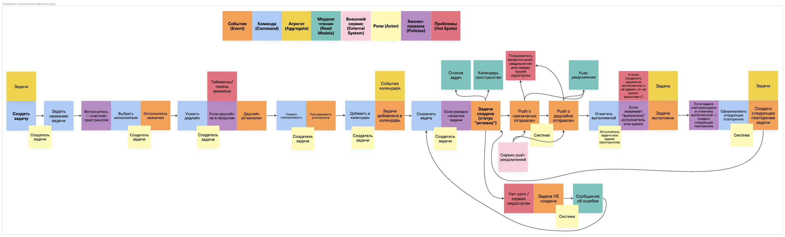

## ***Классификация стейкхолдеров по матрице RACI***

Стейкхолдеры те же, что были описаны в «Концепции и границах»: пользователи/админы пространств, инвесторы, заказчик/инициатор, владелец продукта, команда разработки, маркетологи. 

Рассмотрим функционал приглашения/входа по коду в пространство (FR-03/FR-04: код приглашения, генерация кода, недействительность старого кода и т.д.). 

|Задачи \ Участники |Юзеры|Инвесторы/спонсоры|Заказчик/инициатор|Владелец продукта|Команда разраб.|Марке-толог|
|-|-|-|-|-|-|-|
|Формирование и согласование бизнес-требования|C|I|A|**A/R**|R|I|
|Определить границы MVP, приоритеты (в т.ч. сроки, бюджет)|-|C|**A**|R|C|I|
|Спроектировать UX |C|I|I|**A**|**R**|C|
|Сделать UI-макеты |-|I|I|A|**R**|C|
|Подготовить инструкции и онбординг|C|I|I|**A**|C|**R**|
|Написать код для реализации фичи|-|I|I|**A**|**R**|I|
|Протестировать и провести приемку|C|I|I|**A**|**R**|I|
|Описать критерии успеха фичи и их метрики|C|C|C|A|R|C|

:::note
*R = Responsible (also recommender) - непосредственно выполняет задание. A = Accountable - принимает работу и несёт ответственность за результат. C = Consulted - оказывает консультативную помощь. I = Informed - в курсе принимаемых решений и хода выполнения задачи.*
:::

**Пользователи**: влияют на реализацию фичи через анкеты/CustDev и участие в тестировании, также могут косвенно влиять на критерии приемки и метрики успеха.

**Инвесторы / спонсоры**: участвуют в формировании ожиданий к MVP, приоритетов и ограничений по срокам и бюджету, также могут консультировать по ожидаемым успехам. Не принимают решения по реализации - только получают информацию о принятых решениях и прогрессе.

**Заказчик / инициатор**: принимает ключевые решения: утверждает бизнес-требования и границы MVP (в том числе сроки, бюджет, приоритеты) - задаёт ограничения, в рамках которых владелец продукта и команда реализуют механику приглашений/входа по коду. Также участвует в формировании критериев успешности внедрения функционала. В реализации не участвует, но должен быть проинформирован о принимаемых решениях и прогрессе.

**Владелец продукта**: ключевая роль в исполнении фичи - отвечает за формулирование и согласование требований, определяет, что входит в MVP, устанавливает приоритеты, устанавливает сроки реализации и необходимый бюджет, принимает решения по всему процессу реализации фичи - он ответственнен за результат всей работы.

**Команда разработки**: полностью реализует функционал и обеспечивает работоспособность функционала в рамках MVP. В том числе, участвует в формировании требований, проектировании UI/UX, тестировании и формирует измеримость результата.

**Маркетолог**: отвечает за то, чтобы фича была правильно представлена пользователям - готовит инструкции и онбординг, следит за формулировками в интерфейсе. Также консультирует по критериям успеха с точки зрения привлекательности.

По принципам построения RACI можно убрать из матрицы Инвесторов, т.к. они ничего не исполняют и не контролируют. Но считаю, что для понимания примерной роли стейкхолдеров в проекте на примере одной фичи, наличие данной роли в матрице является полезным.

Также логично было бы разделить всю команду разработки на конкретные роли: разработчик, аналитики, дизайнер, тестировщик. Так как те задачи, которые в матрице поручены команде разработки, будут назначены на разные роли внутри команды. Однако для понимания примерной роли стейкхолдеров в проекте на примере одной фичи корректнее отобразить команду разработки одной ролью. А построить отдельную RACI для команды разработки можно при обсуждении реализации фичи внутри команды.

## ***Вопросы для интервью со стейкхолдерами***

Рассмотрим функционал "Задачи по дому" (создание задачи + отметка выполнения, FR-05/FR-06).

Вопросы для потенциальных пользователей приложения:

|**Вопрос**|**Цель вопроса**|
|-|-|
|1) Какие бытовые задачи вы реально фиксируете регулярно, а какие чаще всего забываются?|Понять необходимость фичи и актуальные сценарии использования.|
|2) Где и как вы ведете задачи сейчас и какие недостатки этого решения можете отметить?|Понять, не упустили ли мы какие-либо проблемы потенциальных пользователей|
|3) Как вы обычно распределяете задачи: назначаете конкретного исполнителя на определенный вид задач или по принципу “кто свободен, тот и делает”?|Проверить важность назначения исполнителя и понять востребованность сценария создания задачи “без исполнителя”.|
|4) Если у задачи нет исполнителя, кто должен получать напоминания/уведомления о создании (все участники, только админы, никто)?|Определить поведение уведомлений по умолчанию в сценарии “без исполнителя”, чтобы не перегрузить людей пушами, но и не обделить важными пушами.|
|5) В каких случаях важно, чтобы задачу мог закрыть только исполнитель/админ, а в каких - любой участник?|Утвердить концепцию ролей и прав в пространствах, в частности её влияние на смену статусов задач.|
|6) Что для вас означает “выполнено”: достаточно одной отметки (поставить "галочку" у задачи), или нужно, например, подтверждение действия другими участниками, или вообще требуется комментарий/фото?|Уточнить механику закрытия задачи. Понять, планировать ли в следующих релизах расширение функционала закрытия задач. Вероятно, пользователям изначально важны доп.возможности, кроме "галочки".|
|7) Как вы устанавливаете сроки для задач: важны точные дата и время или достаточно “сегодня/завтра/на неделе”? Возможно для каких-то ваших задач не нужны дедлайны?|Понять требования к дедлайнам и точности сроков.|
|8) Часто ли вы забываете о задачах? Чувствуете ли вы необходимость в напоминаниях о них? Устанавливаете ли напоминания сейчас и как (в каких программах, в каких ситуациях, в какие сроки, за какое время до дедлайна должно приходить напоминание, сколько напоминаний)? Есть ли необходимость в отправке напоминаний кому-то, кроме исполнителя задачи?|Убедиться в необходимости добавления напоминаний для задач и понять желания людей относительно напоминаний (чтобы, например, предлагать удобные варианты по умолчанию).|
|9) Нужны ли уведомления о назначении задачи на пользователя?|Понять, хотят ли пользователи получать уведомления о назначении задач .|
|10) Какие повторяющиеся задачи у вас есть и какая их типичная периодичность (ежедневно/еженедельно/ежемесячно/по определенным дням недели)?|Уточнить модель повторяемости задач. Понять, как именно пользователям будет удобнее задавать повторяемость.|
|11) Если задачу пропустили, что должно происходить? Например, перенос задачи на какой-то срок или сбор таких задач в одном месте (автоформирование списка пропущенных задач)|Понять ожидания пользователей в случаях невыполнения задач в нужный срок.|
|12) Когда вы хотите добавлять задачу в календарь: всегда автоматически или только вручную? Для каких задач какой вариант полезнее и с какими задачами насколько часто вы сталкиваетесь?|Подтвердить востребованность опции “Добавить в календарь”. Понять, какой сценарий добавления задачи в календарь должен быть по умолчанию.|
|13) Как думаете, те, с кем вы ведете быт, на мои вопросы ответили бы примерно так, как и вы? Или у них могут быть иные предпочтения? (Уточнить, в чем по его мнению их предпочтения могли бы расходиться)|Понять хотя бы по субъективному мнению опрашиваемого, смог бы ли он вести быт так, как описывает в ответах на вопросы. Если у его сожителей другие предпочтения, это может стать препятствием. Желательно понять точки, в которых могут возникнуть проблемы.|

Вопросы для владельца продукта:

|Вопрос|Цель вопроса|
|-|-|
|14) Как мы поймём, что функционал ведения бытовых задач в MVP успешен: какие метрики/пороги считаем успехом? (активация, использование задач в пространстве, retention)|Связать задачи с критериями успеха продукта и критериями приёмки.|
|15) Какие сценарии точно должны войти в MVP ведения задач, а какие откладываем? (например, комментарии к задачам, расширенные роли с правами, визуализация в канбан)|Зафиксировать границы MVP и не допустить расползания требований.|

Вопросы для команды разработки:

|Вопрос|Цель вопроса|
|-|-|
|16) Какие ограничения вы считаете критичными для функционала ведения задач, и какое поведение системы вы предлагаете зафиксировать как стандартное?|Зафиксировать список критичных сценариев и договориться о правилах поведения системы в них, чтобы учесть это в требованиях и тест-кейсах.|

Вопросы для маркетолога:

|Вопрос|Цель вопроса|
|-|-|
|17) Какие моменты в ведении задач пользователи чаще всего не понимают и какие подсказки/онбординг нужны для фичи ведения задач?|Собрать требования к текстам, подсказкам и короткому онбордингу, чтобы снизить порог входа и повысить активацию.|

## **Event Storming**

Построение Event Storming для бизнес-процесса создания и выполнения задачи (FR-05/FR-06): [https://unidraw.io/app/board/896a8245578b39ac8377](https://unidraw.io/app/board/896a8245578b39ac8377)

