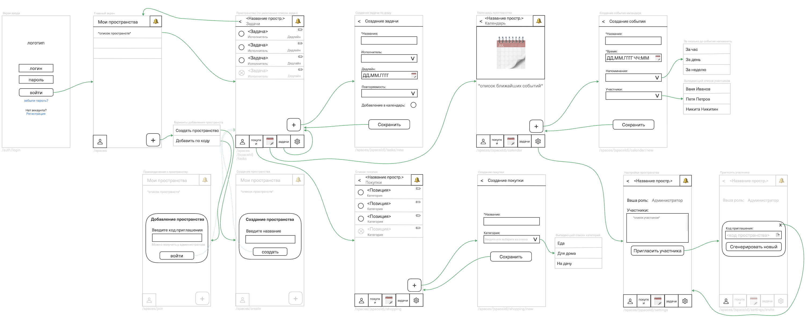

Макеты экранов для основных юз кейсов: [https://unidraw.io/app/board/3bd718ec4538983c8eb2](https://unidraw.io/app/board/3bd718ec4538983c8eb2)

Endpoints для элементов и действий, размещенных на экранах:

|Экран |Действие|Method|Endpoint|
|-|-|-|-|
|Экран входа|Вход в приложение|POST|`/auth/login`|
|Экран входа|Регистрация|POST|`/auth/register`|
|Экран входа|Восстановление доступа|POST|`/auth/recovery`|
|Мои пространства|Загрузка списка пространств|GET|`/spaces`|
|Мои пространства|Создание пространства|POST|`/spaces`|
|Добавление пространства|Вход по коду приглашения|POST|`/spaces/join`|
|Пространство / Задачи|Загрузка списка задач пространства|GET|`/spaces/{spaceId}/tasks`|
|Пространство / Задачи|Отметить задачу выполненной / вернуть в активные|PATCH|`/spaces/{spaceId}/tasks/{taskId}/status`|
|Пространство / Задачи|Редактировать задачу|PATCH|`/spaces/{spaceId}/tasks/{taskId}`|
|Пространство / Задачи|Удалить задачу|DELETE|`/spaces/'{spaceId}/tasks/{taskId}`|
|Создание задачи|Загрузка участников для выбора исполнителя|GET|`/spaces/{spaceId}/members`|
|Создание задачи|Создание задачи|POST|`/spaces/{spaceId}/tasks`|
|Пространство / Покупки|Загрузка списка покупок|GET|`/spaces/{spaceId}/shopping`|
|Создание покупки|Создание позиции в списке покупок|POST|`/spaces/{spaceId}/shopping`|
|Создание покупки|Загрузка категорий покупок|GET|`/spaces/{spaceId}/shopping/categories`|
|Создание покупки|Создание новой категории покупки|POST|`/spaces/{spaceId}/shopping/categories`|
|Создание покупки|Удаление категории покупки|DELETE|`/spaces/{spaceId}/shopping/categories/{categoryId}`|
|Пространство / Покупки|Изменить позицию|PATCH|`/spaces/{spaceId}/shopping/{itemId}`|
|Пространство / Покупки|Удалить позицию|DELETE|`/spaces/{spaceId}/shopping/{itemId}`|
|Календарь пространства|Загрузка событий календаря|GET|`/spaces/{spaceId}/calendar`|
|Создание события|Загрузка участников для выбора|GET|`/spaces/{spaceId}/members`|
|Создание события|Создание события|POST|`/spaces/{spaceId}/calendar`|
|Календарь пространства|Редактировать событие|PATCH|`/spaces/{spaceId}/calendar/{eventId}`|
|Календарь пространства|Удалить событие|DELETE|`/spaces/{spaceId}/calendar/{eventId}`|
|Настройки пространства|Загрузка информации о пространстве|GET|`/spaces/{spaceId}`|
|Настройки пространства|Загрузка списка участников|GET|`/spaces/{spaceId}/members`|
|Пригласить участника|Загрузка текущего кода приглашения|GET|`/spaces/{spaceId}/invite-code`|
|Пригласить участника|Сгенерировать новый код|PATCJ|`/spaces/{spaceId}/invite-code`|

