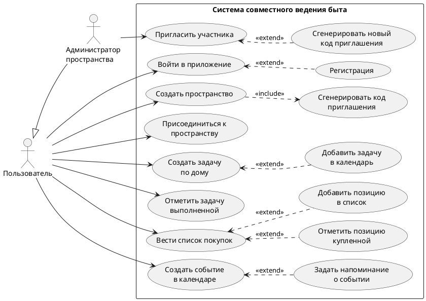
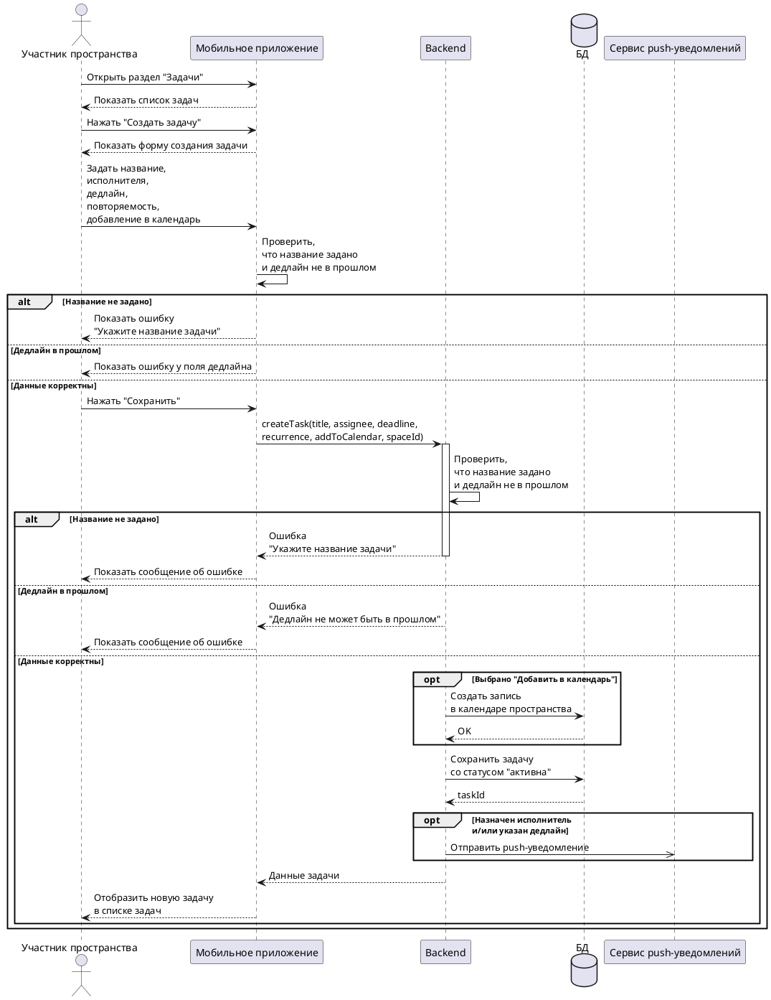

**Use Case Diagram**

Диаграмма вариантов использования отображает ключевые сценарии MVP приложения для совместного ведения быта:


<details>
  <summary>Показать код</summary>

```Plain Text
@startuml
left to right direction
skinparam nodesep 15
skinparam ranksep 25

actor "Пользователь" as User
actor "Администратор\nпространства" as Admin

User <|-- Admin

rectangle "Система совместного ведения быта" {
  usecase "Войти в приложение" as UC_Login
  usecase "Регистрация" as UC_LoginReg

  usecase "Создать пространство" as UC_CreateSpace
  usecase "Сгенерировать код\nприглашения" as UC_GenCode

  usecase "Присоединиться к\nпространству" as UC_Join

  usecase "Создать задачу\nпо дому" as UC_CreateTask
  usecase "Добавить задачу\nв календарь" as UC_AddToCalendar
  usecase "Отметить задачу\nвыполненной" as UC_CompleteTask
  usecase "Вести список покупок" as UC_ShoppingList
  usecase "Добавить позицию\nв список" as UC_ShoppingListAdd
  usecase "Отметить позицию\nкупленной" as UC_ShoppingListCompl

  usecase "Создать событие\nв календаре" as UC_CreateEvent
  usecase "Задать напоминание\nо событии" as UC_CreateEventRem

  usecase "Пригласить участника" as UC_Invite
  usecase "Сгенерировать новый\nкод приглашения" as UC_RegenCode
}

User --> UC_Login
User --> UC_CreateSpace
User --> UC_Join
User --> UC_CreateTask
User --> UC_CompleteTask
User --> UC_ShoppingList
User --> UC_CreateEvent

Admin --> UC_Invite

UC_CreateSpace ..> UC_GenCode : <<include>>
UC_AddToCalendar ..> UC_CreateTask : <<extend>>
UC_RegenCode ..> UC_Invite : <<extend>>
UC_Login <.. UC_LoginReg : <<extend>>

UC_ShoppingList <.. UC_ShoppingListAdd : <<extend>>
UC_ShoppingList <.. UC_ShoppingListCompl : <<extend>>

UC_CreateEvent <.. UC_CreateEventRem : <<extend>>

' Скрытые связи только для раскладки
UC_Invite -[hidden]-> UC_RegenCode
UC_CreateTask -[hidden]-> UC_AddToCalendar

@enduml
```
</details>

**Sequence Diagram**

Диаграмма последовательности построена для варианта использования FR-05 “Создание задачи по дому”. На диаграмме отражены основные участники взаимодействия: участник пространства, мобильное приложение, backend API, база данных и сервис push-уведомлений. Показаны основной сценарий, а также альтернативные/исключительные ветки: пустое название задачи, дедлайн в прошлом, добавление задачи в календарь и отправка уведомления.




<details>
  <summary>Показать код</summary>

```Plain Text
@startuml
actor "Участник пространства" as User
participant "Мобильное приложение" as App
participant "Backend" as API
database "БД" as DB
participant "Сервис push-уведомлений" as Push

User -> App: Открыть раздел "Задачи"
App --> User: Показать список задач
User -> App: Нажать "Создать задачу"
App --> User: Показать форму создания задачи
User -> App: Задать название,\nисполнителя,\nдедлайн,\nповторяемость,\nдобавление в календарь

App -> App: Проверить,\nчто название задано\nи дедлайн не в прошлом

alt Название не задано
  App --> User: Показать ошибку\n"Укажите название задачи"
else Дедлайн в прошлом
  App --> User: Показать ошибку у поля дедлайна
else Данные корректны
  User -> App: Нажать "Сохранить"
  App -> API: createTask(title, assignee, deadline,\nrecurrence, addToCalendar, spaceId)
  activate API

  API -> API: Проверить,\nчто название задано\nи дедлайн не в прошлом

  alt Название не задано
    API --> App: Ошибка\n"Укажите название задачи"
    deactivate API
    App --> User: Показать сообщение об ошибке
  else Дедлайн в прошлом
    API --> App: Ошибка\n"Дедлайн не может быть в прошлом"
    deactivate API
    App --> User: Показать сообщение об ошибке
  else Данные корректны
    opt Выбрано "Добавить в календарь"
      API -> DB: Создать запись\nв календаре пространства
      DB --> API: OK
    end

    API -> DB: Сохранить задачу\nсо статусом "активна"
    DB --> API: taskId

    opt Назначен исполнитель\nи/или указан дедлайн
      API ->> Push: Отправить push-уведомление
    end

    API --> App: Данные задачи
    deactivate API
    App --> User: Отобразить новую задачу\nв списке задач
  end
end

@enduml
```
</details>

